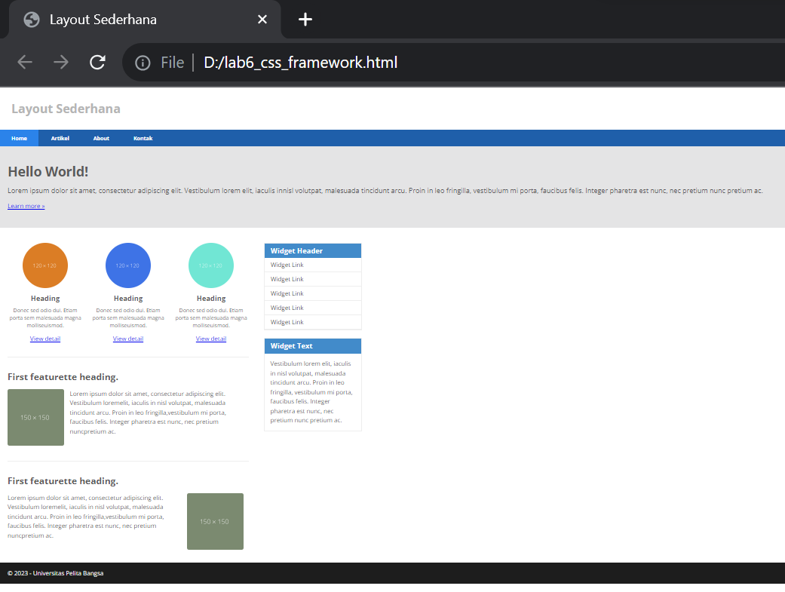

# Lab6web
# Nama : Muhammad Din Al Ayubi
# Kelas : TI.22.A3
# NIM : 312210293

## Praktikum 6: Web Framework
## Instruksi Praktikum
Instruksi Praktikum
1. Persiapkan text editor misalnya VSCode.
2. Buat folder baru dengan nama lab6_css_framework
3. Buat file baru dokumen html
4. Buat struktur dasar dari dokumen HTML.
5. Buatlah layout web sederhana menggunakan css framework (Twitter Bootsrtap).
6. Lakukan validasi dokumen html dengan mengakses http://validator.w3.org
* Berdasarkan gambar layout web berikut, buatlah menggunakan Twitter Bootstrap.
## Langkah-langkah Praktikum
* Persiapan membuat dokumen HTML dengan nama file ```lab6_css_framework``` seperti berikut.
## Membuat Layout Sederhana
* Kita akan membuat layout web sederhana seperti gambar berikut.

## Buat folder baru dengan nama ```lab6_css_framework```,  dan file css dengan nama ```style.css```.
```python
<!DOCTYPE html>
<html lang="en">
<head>
    <meta charset="UTF-8">
    <meta name="viewport" content="width=device-width, initial-scale=1.0">
    <title>Layout Sederhana</title>
    <link rel="stylesheet" href="style.css">
</head>
<body>
    <div id="container">

    </div>
</body>
```
## Kemudian tulis kode berikut.
```python
<header>
    <h1>Layout Sederhana</h1>
</header>
<nav>
    <a href="home.html" class="active">Home</a>
    <a href="artikel.html">Artikel</a>
    <a href="about.html">About</a>
    <a href="kontak.html">Kontak</a>
</nav>
<section id="hero"></section>
<section id="wrapper">
    <section id="main"></section>
    <aside id="sidebar"></aside>
</section>
<footer>
    <p>&copy; 2023 - Universitas Pelita Bangsa</p>
</footer>
```
## Kemudian tambahkan kode CSS untuk membuat layoutnya.
```python
/* import google font */
@import
url('https://fonts.googleapis.com/css2?family=Open+Sans:ital,wght@0,300;0,400;0,600;0,700;0,800;1,300;1,400;1,600;1,700;1,800&display=swap');
@import
url('https://fonts.googleapis.com/css2?family=Open+Sans+Condensed:ital,wght@0,300;0,700;1,300&display=swap');
/* Reset CSS */
* {
    margin: 0;
    padding: 0;
}
body {
    line-height:1;
    font-size:100%;
    font-family:'Open Sans', sans-serif;
    color:#5a5a5a;
}
#container {
    width: 980px;
    margin: 0 auto;
    box-shadow: 0 0 1em #cccccc;
}
/* header */
header {
    padding: 20px;
}
header h1 {
    margin: 20px 10px;
    color: #b5b5b5;
}
```
## Membuat Navigasi
* Kemudian selanjutnya mengatur navigasi.
```python
/* navigasi */
nav {
    display: block;
    background-color: #1f5faa;
}
nav a {
    padding: 15px 30px;
    display: inline-block;
    color: #ffffff;
    font-size: 14px;
    text-decoration: none;
    font-weight: bold;
}
nav a.active,
nav a:hover {
    background-color: #2b83ea;
}
```
## Membuat Hero Panel.
* Selanjutnya membuat hero panel. Tambahkan kode HTML dan CSS seperti berikut.
```python
<section id="hero">
    <h1>Hello World!</h1>
    <p>Lorem ipsum dolor sit amet, consectetur adipiscing elit. Vestibulum lorem
        elit, iaculis innisl volutpat, malesuada tincidunt arcu. Proin in leo fringilla,
        vestibulum mi porta, faucibus felis. Integer pharetra est nunc, nec pretium nunc
        pretium ac.</p>
        <a href="home.html" class="btn btn-large">Learn more &raquo;</a>
</section>
```
```python
/* Hero Panel */
#hero {
    background-color: #e4e4e5;
    padding: 50px 20px;
    margin-bottom: 20px;
}
    #hero h1 {
    margin-bottom: 20px;
    font-size: 35px;
}
#hero p {
    margin-bottom: 20px;
    font-size: 18px;
    line-height: 25px;
}
```
## Mengatur Layout Main dan Sidebar
* Selanjutnya mengatur main content dan sidebar, tambahkan CSS float.
```python
/* main content */
#wrapper {
    margin: 0;
}
#main {
    float: left;
    width: 640px;
    padding: 20px;
}
```
## Membuat Sidebar Widget
* Kemudian selanjutnya menambahkan element lain dalam sidebar.
```python
 <aside id="sidebar"><div class="widget-box">
        <h3 class="title">Widget Header</h3>
        <ul>
            <li><a href="#">Widget Link</a></li>
            <li><a href="#">Widget Link</a></li>
            <li><a href="#">Widget Link</a></li>
            <li><a href="#">Widget Link</a></li>
            <li><a href="#">Widget Link</a></li>
    </ul>
    </div>
    <div class="widget-box">
        <h3 class="title">Widget Text</h3>
        <p>Vestibulum lorem elit, iaculis in nisl volutpat, malesuada tincidunt
            arcu. Proin in leo fringilla, vestibulum mi porta, faucibus felis. Integer
            pharetra est nunc, nec pretium nunc pretium ac.</p>
        </div>
    </aside>
```
* Kemudian tambahkan CSS.
```python
/* widget */
.widget-box {
    border:1px solid #eee;
    margin-bottom:20px;
}
.widget-box .title {
    padding:10px 16px;
    background-color:#428bca;
    color:#fff;
}
.widget-box ul {
    list-style-type:none;
}
.widget-box li {
    border-bottom:1px solid #eee;
}
.widget-box li a {
    padding:10px 16px;
    color:#333;
    display:block;
    text-decoration:none;
}
.widget-box li:hover a {
    background-color:#eee;
}
.widget-box p {
    padding:15px;
    line-height:25px;
}
```
## Mengatur Footer
* Selanjutnya mengatur tampilan footer. Tambahkan CSS untuk footer.
```python
/* footer */
footer {
    clear:both;
    background-color:#1d1d1d;
    padding:20px;
    color:#eee;
}
```
## Menambahkan Elemen lainnya pada Main Content
```python
<section id="main">
        <div class="row">
            <div class="box">
                
                <h3>Heading</h3>
                <p>Donec sed odio dui. Etiam porta sem malesuada magna molliseuismod.</p>
                <a href="#" class="btn btn-default">View detail</a>
            </div>
            <div class="box">
                
                <h3>Heading</h3>
                <p>Donec sed odio dui. Etiam porta sem malesuada magna molliseuismod.</p>
                <a href="#" class="btn btn-default">View detail</a>
            </div>
            <div class="box">
                
                <h3>Heading</h3>
                <p>Donec sed odio dui. Etiam porta sem malesuada magna molliseuismod.</p>
                <a href="#" class="btn btn-default">View detail</a>
            </div>
        </div>
```
## Kemudian tambahkan CSS.
```python
/* box */
.box {
    display:block;
    float:left;
    width:33.333333%;
    box-sizing:border-box;
    -moz-box-sizing:border-box;
    -webkit-box-sizing:border-box;
    padding:0 10px;
    text-align:center;
}
.box h3 {
    margin: 15px 0;
}
.box p {
    line-height: 20px;
    font-size: 14px;
    margin-bottom: 15px;
}
box img {
    border: 0;
    vertical-align: middle;
}
.image-circle {
    border-radius: 50%;
}
.row {
    margin: 0 -10px;
    box-sizing: border-box;
    -moz-box-sizing: border-box;
    -webkit-box-sizing: border-box;
}
.row:after, .row:before,
.entry:after, .entry:before {
    content:'';
    display:table;
}
.row:after,
.entry:after {
    clear:both;
}
```
## Menambahkan Content Artikel
* Selanjutnya membuat content artikel. Tambahkan HTML berikut pada main content.
```python
</div>
        <hr class="divider" />
        <article class="entry">
            <h2>First featurette heading.</h2>
            
            <p>Lorem ipsum dolor sit amet, consectetur adipiscing elit. Vestibulum loremelit, iaculis in nisl volutpat, malesuada tincidunt arcu. Proin in leo fringilla,vestibulum mi porta, faucibus felis. Integer pharetra est nunc, nec pretium nuncpretium ac.</p>
        </article>
        <hr class="divider" />
        <article class="entry">
            <h2>First featurette heading.</h2>
            
            <p>Lorem ipsum dolor sit amet, consectetur adipiscing elit. Vestibulum loremelit, iaculis in nisl volutpat, malesuada tincidunt arcu. Proin in leo fringilla,vestibulum mi porta, faucibus felis. Integer pharetra est nunc, nec pretium nuncpretium ac.</p>
        </section>
```
* Kemudian tambahkan CSS.
```python
.divider {
    border:0;
    border-top:1px solid #eeeeee;
    margin:40px 0;
}
/* entry */
.entry {
    margin: 15px 0;
}
.entry h2 {
    margin-bottom: 20px;
}
.entry p {
    line-height: 25px;
}
.entry img {
    float: left;
    border-radius: 5px;
    margin-right: 15px;
}
.entry .right-img {
    float: right;
}
```
## Hasil Output
